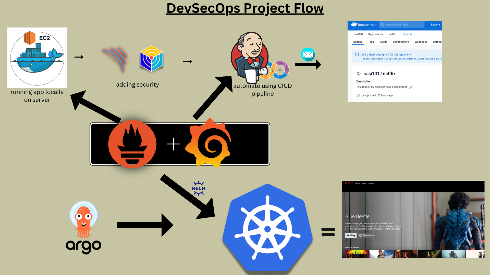

# Deploy Netflix Clone on AWS using Jenkins - DevSecOps Project

## ⚠️ Important Project Disclaimers

> [!IMPORTANT]
> Please read the following notices carefully before deploying, sharing, or exploring this repository.

---

> **Educational use only.** This is an unofficial streaming UI created to demonstrate DevSecOps workflows. It is not affiliated with or endorsed by Netflix. It uses TMDB metadata when you provide a TMDB v3 API key and is not endorsed or certified by TMDB.

### 🛡️ Production vs. Lab Environment Guidance

This project is configured as a **practical lab guide**. Running all tools on a single host is intended for isolated testing and learning.

For **production workloads**, you must adhere to the following architecture hardening standards:

* **Decoupled Architecture:** Place Jenkins, SonarQube, monitoring suites (Prometheus/Grafana), and the core application on separate dedicated hosts or managed services.
* **In-Transit Security:** Enforce HTTPS/TLS across all public and internal service endpoints.
* **Network Segmentation:** Heavily restrict network access using strict firewall rules, security groups, and private subnets.
* **Data Protection:** Encrypt all persistent storage volumes at rest.
* **Supply Chain Security:** Pin all software versions, package dependencies, and base container image tags to immutable versions.

## I. OVERVIEW

This project demonstrates an end-to-end DevSecOps workflow for deploying a React-based Netflix clone on AWS.

The workflow uses Jenkins for continuous integration and deployment, SonarQube for static code analysis, OWASP Dependency-Check and Trivy for vulnerability scanning, Docker for packaging and deployment, and Prometheus with Grafana for monitoring.

The guide also includes an optional Kubernetes and Argo CD phase for teams that want to move from a single EC2 deployment to GitOps-based delivery on Amazon EKS.


[](http://netflix-clone-with-tmdb-using-react-mui.vercel.app/)

*Home Page*

## II. ARCHITECTURE & TOOLCHAIN

| Area | Tool or Service | Purpose |
| :--- | :--- | :--- |
| **Cloud platform** | AWS EC2 / Amazon EKS | Compute and optional Kubernetes orchestration |
| **Source control** | GitHub | Application and pipeline source |
| **CI/CD** | Jenkins | Automated build, scan, push, and deployment |
| **Code quality** | SonarQube | Static analysis and Quality Gate enforcement |
| **Dependency security** | OWASP Dependency-Check | Known-vulnerability analysis for dependencies |
| **Container security** | Trivy | Filesystem, secret, configuration, and image scanning |
| **Packaging** | Docker | Reproducible application image |
| **Registry** | Docker Hub | Container image storage |
| **Monitoring** | Prometheus, Node Exporter, Grafana | Metrics collection and visualization |
| **GitOps** | Argo CD | Optional Kubernetes deployment automation |

## III.📋 PREREQUISITES

Before starting, ensure you have prepared the following:

* **☁️ AWS Account:** Active account with administrative permissions to provision EC2 instances, Security Groups, IAM Roles, and optionally EKS clusters.
* **🐙 GitHub Repository:** A configured repository containing the application source code and this `README.md`.
* **🎬 TMDB Account:** A registered The Movie Database (TMDB) account with an active API Key generated for application authentication.
* **🐳 Docker Hub Account:** A Docker Hub registry account for hosting and pulling your container images.
* **🌐 Custom Domain (Optional):** A valid domain name and TLS/SSL certificate configured if you plan to deploy to a production environment.
* **🧠 Core Knowledge:** A foundational familiarity with Linux administration, Docker containerization, Git version control, Jenkins pipelines, and AWS networking concepts.

## IV 💻 Recommended EC2 Capacity

If you plan to run all lab components together on a single host, provision an EC2 instance that meets or exceeds the following baseline specifications:

| Resource | Minimum Requirement | Recommended Specification |
| :--- | :--- | :--- |
| **OS Platform** | Ubuntu Server 24.04 LTS | Ubuntu Server 24.04 LTS |
| **Compute** | 4 vCPUs | 4 vCPUs or higher |
| **Memory (RAM)** | 8 GiB | 16 GiB |

> ⚠️ **Important Deployment Note:** Running tools like Jenkins, SonarQube, Prometheus, Grafana, and Docker containers simultaneously is resource-intensive. Staying at or above the **16 GiB RAM** recommendation will prevent out-of-memory errors and pipeline crashes during high-load compilation or scanning stages.

## 2.2.2. Security Group Guidance

Restrict each port to the smallest possible source range or security group.

| **Port** | **Service**         | **Recommended source**                       |
|----------|---------------------|----------------------------------------------|
| 22       | SSH                 | Your administrator IP only                   |
| 8080     | Jenkins             | Your administrator IP, VPN, or reverse proxy |
| 9000     | SonarQube           | Jenkins security group and administrator IP  |
| 8081     | Netflix application | Intended users or load balancer              |
| 9090     | Prometheus          | Monitoring administrators only               |
| 3000     | Grafana             | Monitoring administrators only               |
| 9100     | Node Exporter       | Prometheus host or security group only       |

Do not expose administrative services to `0.0.0.0/0` unless the environment is temporary and isolated.

<!-- markdownlint-disable MD033 -->
<h1 align="center">🌟 PHASE 1: Initial Setup and Deployment</h1>

## 💡 <u>STEP 1.1: Launch EC2 (Ubuntu Server 24.04 LTS):</u>

* Provision an EC2 instance on AWS with Ubuntu 24.04 with at least a 4GiB Memory and 20 GiB gp3 root volume
* Connect to the instance.

## 💡 <u>STEP 1.2: Clone the Code: </u>

* Update all the packages and then clone the code.
* Clone your application's code repository onto the EC2 instance:

    ```bash
    git clone https://github.com/UrsulaN1/DevSecOps.git
    cd DevSecOps
    ```

## 💡 <u>STEP 1.3: Install Docker and Run the App Using a Container:</u>

* Set up Docker on the EC2 instance and add user to docker group to use sudo privileges:

    ```bash
    sudo apt-get update
    sudo apt-get install docker.io -y   # this command create the docker group automatically. Otherwise, create group with "sudo groupadd docker"
    sudo usermod -aG docker $USER
    newgrp docker
    ```

## 💡 <u>STEP 1.4: Create Docker Image Using Your Movie Database API Key:</u>

* Open a web browser and navigate to TMDB (The Movie Database) website on [https://themoviedb.org]
* Click on "Login" and create an account.
* Once logged in, go to your profile and select "Settings."
* Click on "API" from the left-side panel.
* Create a new API key by clicking "Create" and accepting the terms and conditions.
* Provide the required basic details and click "Submit."
* You will receive your TMDB API key.

* Build and run your application using Docker containers:

    ```bash
    docker build --build-arg TMDB_V3_API_KEY=<your-api-key> -t netflix .
    docker run -d --name netflix -p 8081:80 netflix:latest
    
    ```

<h1 align="center">🌟 PHASE 2: SECURITY</h1>

## 💡 <u>STEP 2.1: Install SonarQube and Trivy:</u>

* Run SonarQube and Trivy containers on the EC2 instance to scan for vulnerabilities.

### SonarQube

```bash
docker run -d --name sonar -p 9000:9000 sonarqube:lts-community
```

To access:

publicIP:9000 (by default username & password is admin)

### Trivy

```bash
sudo apt-get install wget gnupg
wget -qO - https://aquasecurity.github.io/trivy-repo/deb/public.key | gpg --dearmor | sudo tee /usr/share/keyrings/trivy.gpg > /dev/null
echo "deb [signed-by=/usr/share/keyrings/trivy.gpg] https://aquasecurity.github.io/trivy-repo/deb generic main" | sudo tee -a /etc/apt/sources.list.d/trivy.list
sudo apt-get update
sudo apt-get install trivy      
```

To scan image using trivy

```bash
trivy image <imageid>
```

<h1 align="center">🌟 PHASE 3: CI/CD Setup</h1>

## 💡 <u>STEP 3.1: Install Jenkins for Automation:</u>

* Install Jenkins on the EC2 instance to automate deployment:

```bash
# java Installation
sudo apt update
sudo apt install fontconfig openjdk-21-jre -y
java -version
    
#Jenkins Installation
sudo wget -O /etc/apt/keyrings/jenkins-keyring.asc \
https://pkg.jenkins.io/debian-stable/jenkins.io-2026.key
echo "deb [signed-by=/etc/apt/keyrings/jenkins-keyring.asc]" \
https://pkg.jenkins.io/debian-stable binary/ | sudo tee \
/etc/apt/sources.list.d/jenkins.list > /dev/null

sudo apt update
sudo apt install jenkins -y
sudo systemctl start jenkins
sudo systemctl enable jenkins
sudo systemctl status jenkins --no-pager
```

* Access Jenkins in a web browser using the public IP of your EC2 instance.

publicIp:8080

```bash
sudo cat /var/lib/jenkins/secrets/initialAdminPassword
```

## 💡 <u>STEP 3.2: Install Necessary Plugins in Jenkins:</u>

Goto Manage Jenkins → Plugins → Available Plugins →

* Eclipse Temurin Installer
* SonarQube Scanner
* NodeJs
* OWASP Dependency-Check
* Docker Pipeline
* Kubernetes CLI
* Email Extension
* Workspace Cleanup
* Pipeline stage view

Create or confirm these Jenkins items before running the pipeline:

* JDK tool named `jdk17`
* NodeJS tool named `node24`
* SonarScanner tool named `sonar-scanner`
* SonarQube server named `sonar-server`
* Secret-text credential `tmdb-api-key`
* Docker registry credential `docker`
* Kubernetes credential `k8s`
* OWASP Dependency-Check installation `DP-Check`
* Jenkins plugins used by the pipeline:
* Trivy installed on the Jenkins agent

## 💡 <u>STEP 3.3: Configure Java and Nodejs in Global Tool Configuration:</u>

**Goto Manage Jenkins → Tools** → Install JDK(17) and NodeJs(16)→

Click on Apply and Save

## 💡 <u>STEP 3.4: Generate the SonarQube Token:</u>

**In the SonarQube interface:**

Profile icon → My Account → Security

Under Generate Tokens:

Enter a descriptive name, such as ```***jenkins-token***```.
Select a token type.
Choose an expiration date.
Click Generate.

## 💡 <u>STEP 3.5: Add the SonarQube token in Jenkins as a Secret Text Credential:</u>

Goto Jenkins Dashboard → Manage Jenkins → Credentials → Add Secret Text.

```groovy
Kind:        Secret text
Scope:       Global
Secret:      Paste your SonarQube token
ID:          Sonar-token
Description: SonarQube authentication token
```

Click on Apply and Save

## 💡 <u>STEP 3.6: Configure the SonarQube webhook:</u>

In SonarQube, navigate to:

Administration
→ Configuration
→ Webhooks
→ Create

Enter:

Name: Jenkins
URL: http://JENKINS_PRIVATE_IP:8080/sonarqube-webhook/

## 💡 <u>STEP 3.7: Configure the SonarQube server and scanner installation in Jenkins:</u>

**Goto Manage Jenkins → System** →
SonarQube servers:
**name**: sonar-server
**server URL**: [http://sonarqube-PUBLIC-IP]:9000
**Server authentication token**: Sonar-token

**Goto Manage Jenkins → Tools** →
Sonar Scanner installation:
**name**: sonar-scanner

## 💡 <u>STEP 3.7: Configure CI/CD Pipeline in Jenkins:</u>

* Create a CI/CD pipeline in Jenkins to automate your application deployment.

```groovy
pipeline {
    agent any
    tools {
        jdk 'jdk17'
        nodejs 'node16'
    }
    environment {
        SCANNER_HOME = tool 'sonar-scanner'
    }
    stages {
        stage('clean workspace') {
            steps {
                cleanWs()
            }
        }
        stage('Checkout from Git') {
            steps {
                git branch: 'main', url: 'https://github.com/UrsulaN1/netflix-clone-DevSecOps.git'
            }
        }
        stage("Sonarqube Analysis") {
            steps {
                withSonarQubeEnv('sonar-server') {
                    sh '''$SCANNER_HOME/bin/sonar-scanner -Dsonar.projectName=Netflix \
                    -Dsonar.projectKey=Netflix'''
                }
            }
        }
        stage("quality gate") {
            steps {
                script {
                    waitForQualityGate abortPipeline: false, credentialsId: 'Sonar-token'
                }
            }
        }
        stage('Install Dependencies') {
            steps {
                sh "npm install"
            }
        }
    }
}
```

**Add DockerHub Credentials:**

1. Generate a Docker Hub access token

In Docker Hub:

Profile icon
→ Account settings
→ Personal access tokens
→ Generate new token

Configure it:

Description: Jenkins
Expiration: Choose an appropriate date
Permissions: Read & Write

Copy the token immediately. Docker Hub only displays it when it is generated.

1. Add the credential to Jenkins

In Jenkins, go to:

Dashboard
→ Manage Jenkins
→ Credentials
→ System
→ Global credentials (unrestricted)
→ Add Credentials

Enter:

Kind:        Username with password
Scope:       Global
Username:    Your Docker Hub username (treat as secret)
Password:    Paste your Docker Hub access token
ID:          dockerhub-credentials
Description: Docker Hub credentials

Click Create.

Use Username with password, not Secret text, because the Docker Pipeline integration expects a username/password credential. The PAT goes in the password field.

Proceed with configuring your Jenkins pipeline to include these tools and credentials in your CI/CD process.

```groovy

pipeline{
    agent any
    tools{
        jdk 'jdk17'
        nodejs 'node16'
    }
    environment {
        SCANNER_HOME=tool 'sonar-scanner'
    }
    stages {
        stage('clean workspace'){
            steps{
                cleanWs()
            }
        }
        stage('Checkout from Git'){
            steps{
                git branch: 'main', url: 'https://github.com/WasimHannure/DevSecOps.git'
            }
        }
        stage("Sonarqube Analysis "){
            steps{
                withSonarQubeEnv('sonar-server') {
                    sh ''' $SCANNER_HOME/bin/sonar-scanner -Dsonar.projectName=Netflix \
                    -Dsonar.projectKey=Netflix '''
                }
            }
        }
        stage("quality gate"){
           steps {
                script {
                    waitForQualityGate abortPipeline: false, credentialsId: 'Sonar-token' 
                }
            } 
        }
        stage('Install Dependencies') {
            steps {
                sh "npm install"
            }
        }
        stage('OWASP FS SCAN') {
            steps {
                dependencyCheck additionalArguments: '--scan ./ --disableYarnAudit --disableNodeAudit', odcInstallation: 'DP-Check'
                dependencyCheckPublisher pattern: '**/dependency-check-report.xml'
            }
        }
        stage('TRIVY FS SCAN') {
            steps {
                sh "trivy fs . > trivyfs.txt"
            }
        }
        stage("Docker Build & Push"){
            steps{
                script{
                   withDockerRegistry(credentialsId: 'docker', toolName: 'docker'){   
                       sh "docker build --build-arg TMDB_V3_API_KEY=<yourapikey> -t netflix ."
                       sh "docker tag netflix wasimhannure/netflix:latest "
                       sh "docker push wasimhanure/netflix:latest "
                    }
                }
            }
        }
        stage("TRIVY"){
            steps{
                sh "trivy image wasimhannure/netflix:latest > trivyimage.txt" 
            }
        }
        stage('Deploy to container'){
            steps{
                sh 'docker run -d --name netflix -p 8081:80 wasimhannure/netflix:latest'
            }
        }
    }
}


If you get docker login failed errorr

sudo su
sudo usermod -aG docker jenkins
sudo systemctl restart jenkins
```

<h1 align="center">🌟 PHASE 4: Monitoring</h1>

## 💡 <u>STEP 4.1 Install Prometheus and Grafana:</u>

   Set up Prometheus and Grafana to monitor your application.

   **Installing Prometheus:**

   First, create a dedicated Linux user for Prometheus and download Prometheus:

   ```bash
   sudo useradd --system --no-create-home --shell /bin/false prometheus
   wget https://github.com/prometheus/prometheus/releases/download/v2.47.1/prometheus-2.47.1.linux-amd64.tar.gz
   ```

   Extract Prometheus files, move them, and create directories:

   ```bash
   tar -xvf prometheus-2.47.1.linux-amd64.tar.gz
   cd prometheus-2.47.1.linux-amd64/
   sudo mkdir -p /data /etc/prometheus
   sudo mv prometheus promtool /usr/local/bin/
   sudo mv consoles/ console_libraries/ /etc/prometheus/
   sudo mv prometheus.yml /etc/prometheus/prometheus.yml
   ```

   Set ownership for directories:

   ```bash
   sudo chown -R prometheus:prometheus /etc/prometheus/ /data/
   ```

   Create a systemd unit configuration file for Prometheus:

   ```bash
   sudo nano /etc/systemd/system/prometheus.service
   ```

   Add the following content to the `prometheus.service` file:

   ```plaintext
   [Unit]
   Description=Prometheus
   Wants=network-online.target
   After=network-online.target

   StartLimitIntervalSec=500
   StartLimitBurst=5

   [Service]
   User=prometheus
   Group=prometheus
   Type=simple
   Restart=on-failure
   RestartSec=5s
   ExecStart=/usr/local/bin/prometheus \
     --config.file=/etc/prometheus/prometheus.yml \
     --storage.tsdb.path=/data \
     --web.console.templates=/etc/prometheus/consoles \
     --web.console.libraries=/etc/prometheus/console_libraries \
     --web.listen-address=0.0.0.0:9090 \
     --web.enable-lifecycle

   [Install]
   WantedBy=multi-user.target
   ```

   Here's a brief explanation of the key parts in this `prometheus.service` file:

* `User` and `Group` specify the Linux user and group under which Prometheus will run.

* `ExecStart` is where you specify the Prometheus binary path, the location of the configuration file (`prometheus.yml`), the storage directory, and other settings.

* `web.listen-address` configures Prometheus to listen on all network interfaces on port 9090.

* `web.enable-lifecycle` allows for management of Prometheus through API calls.

   Enable and start Prometheus:

   ```bash
   sudo systemctl enable prometheus
   sudo systemctl start prometheus
   ```

   Verify Prometheus's status:

   ```bash
   sudo systemctl status prometheus
   ```

   You can access Prometheus in a web browser using your server's IP and port 9090:

   `http://<your-server-ip>:9090`

   **Installing Node Exporter:**

   Create a system user for Node Exporter and download Node Exporter:

   ```bash
   sudo useradd --system --no-create-home --shell /bin/false node_exporter
   wget https://github.com/prometheus/node_exporter/releases/download/v1.6.1/node_exporter-1.6.1.linux-amd64.tar.gz
   ```

   Extract Node Exporter files, move the binary, and clean up:

   ```bash
   tar -xvf node_exporter-1.6.1.linux-amd64.tar.gz
   sudo mv node_exporter-1.6.1.linux-amd64/node_exporter /usr/local/bin/
   rm -rf node_exporter*
   ```

   Create a systemd unit configuration file for Node Exporter:

   ```bash
   sudo nano /etc/systemd/system/node_exporter.service
   ```

   Add the following content to the `node_exporter.service` file:

   ```plaintext
   [Unit]
   Description=Node Exporter
   Wants=network-online.target
   After=network-online.target

   StartLimitIntervalSec=500
   StartLimitBurst=5

   [Service]
   User=node_exporter
   Group=node_exporter
   Type=simple
   Restart=on-failure
   RestartSec=5s
   ExecStart=/usr/local/bin/node_exporter --collector.logind

   [Install]
   WantedBy=multi-user.target
   ```

   Replace `--collector.logind` with any additional flags as needed.

   Enable and start Node Exporter:

   ```bash
   sudo systemctl enable node_exporter
   sudo systemctl start node_exporter
   ```

   Verify the Node Exporter's status:

   ```bash
   sudo systemctl status node_exporter
   ```

   You can access Node Exporter metrics in Prometheus.

## 💡 <u>STEP 4.2 Configure Prometheus Plugin Integration:</u>

   Integrate Jenkins with Prometheus to monitor the CI/CD pipeline.

   **Prometheus Configuration:**

   To configure Prometheus to scrape metrics from Node Exporter and Jenkins, you need to modify the `prometheus.yml` file. Here is an example `prometheus.yml` configuration for your setup:

   ```yaml
   global:
     scrape_interval: 15s

   scrape_configs:
     - job_name: 'node_exporter'
       static_configs:
         - targets: ['localhost:9100']

     - job_name: 'jenkins'
       metrics_path: '/prometheus'
       static_configs:
         - targets: ['<your-jenkins-ip>:<your-jenkins-port>']
   ```

   Make sure to replace `<your-jenkins-ip>` and `<your-jenkins-port>` with the appropriate values for your Jenkins setup.

   Check the validity of the configuration file:

   ```bash
   promtool check config /etc/prometheus/prometheus.yml
   ```

   Reload the Prometheus configuration without restarting:

   ```bash
   curl -X POST http://localhost:9090/-/reload
   ```

   You can access Prometheus targets at:

   `http://<your-prometheus-ip>:9090/targets`

<h1 align="center">🌟 PHASE 5: Install Grafana on Ubuntu 22.04 and Set it up to Work with Prometheus</h1>

## 💡 <u>STEP 5.1: Install Dependencies:**</u>

First, ensure that all necessary dependencies are installed:

```bash
sudo apt-get update
sudo apt-get install -y apt-transport-https software-properties-common
```

## 💡 <u>STEP 5.2: Add the GPG Key:**</u>

Add the GPG key for Grafana:

```bash
wget -q -O - https://packages.grafana.com/gpg.key | sudo apt-key add -
```

## 💡 <u>STEP 5.3: Add Grafana Repository:**</u>

Add the repository for Grafana stable releases:

```bash
echo "deb https://packages.grafana.com/oss/deb stable main" | sudo tee -a /etc/apt/sources.list.d/grafana.list
```

## 💡 <u>STEP 5.4: Update and Install Grafana:**</u>

Update the package list and install Grafana:

```bash
sudo apt-get update
sudo apt-get -y install grafana
```

## 💡 <u>STEP 5.5: Enable and Start Grafana Service:**</u>

To automatically start Grafana after a reboot, enable the service:

```bash
sudo systemctl enable grafana-server
```

Then, start Grafana:

```bash
sudo systemctl start grafana-server
```

## 💡 <u>STEP 5.6: Check Grafana Status:**</u>

Verify the status of the Grafana service to ensure it's running correctly:

```bash
sudo systemctl status grafana-server
```

## 💡 <u>STEP 5.7: Access Grafana Web Interface:**</u>

Open a web browser and navigate to Grafana using your server's IP address. The default port for Grafana is 3000. For example:

`http://<your-server-ip>:3000`

You'll be prompted to log in to Grafana. The default username is "admin," and the default password is also "admin."

## 💡 <u>STEP 5.8: Change the Default Password:**</u>

When you log in for the first time, Grafana will prompt you to change the default password for security reasons. Follow the prompts to set a new password.

## 💡 <u>STEP 5.9: Add Prometheus Data Source:**</u>

To visualize metrics, you need to add a data source. Follow these steps:

* Click on the menu bar in the left sidebar to open the "Connections" menu.

* Select "Data Sources."

* Click on the "Add data source" button.

* Choose "Prometheus" as the data source type.

* In the "HTTP" section:
  * Set the "URL" to `http://localhost:9090` (assuming Prometheus is running on the same server).
  * Click the "Save & Test" button to ensure the data source is working.

## 💡 <u>STEP 5.10: Import a Dashboard:**</u>

To make it easier to view metrics, you can import a pre-configured dashboard. Follow these steps:

* Click on the "+" (plus) icon in the left sidebar to open the "Create" menu.

* Select "Dashboard." > New Dashborad

* Click on the "Import" dashboard option.

* Enter the dashboard code you want to import (e.g., code 1860).

* Click the "Load" button.

* Select the data source you added (Prometheus) from the dropdown.

* Click on the "Import" button.

You should now have a Grafana dashboard set up to visualize metrics from Prometheus.

Grafana is a powerful tool for creating visualizations and dashboards, and you can further customize it to suit your specific monitoring needs.

That's it! You've successfully installed and set up Grafana to work with Prometheus for monitoring and visualization.

## 💡 <u>STEP 5.11 Configure Prometheus Plugin Integration:</u>

Integrate Jenkins with Prometheus to monitor the CI/CD pipeline.

<h1 align="center">🌟 PHASE 6: Notification</h1>

## 💡 <u>STEP 6.1 .Implement Notification Services:</u>

Set up email notifications in Jenkins or other notification mechanisms.

<h1 align="center">🌟 PHASE 7: Kubernetes</h1>

## 💡 <u>STEP 7.1 Create Kubernetes Cluster with Nodegroups</u>

In this phase, you'll set up a Kubernetes cluster with node groups. This will provide a scalable environment to deploy and manage your applications.

## 💡 <u>STEP 7.2 Monitor Kubernetes with Prometheus</u>

Prometheus is a powerful monitoring and alerting toolkit, and you'll use it to monitor your Kubernetes cluster. Additionally, you'll install the node exporter using Helm to collect metrics from your cluster nodes.

## 💡 <u>STEP 7.3 Install Node Exporter using Helm</u>

Install Helm on the netflix server:

```bash
curl https://baltocdn.com/helm/signing.asc | gpg --dearmor | sudo tee /usr/share/keyrings/helm.gpg > /dev/null
sudo apt-get install apt-transport-https --yes
echo "deb [arch=$(dpkg --print-architecture) signed-by=/usr/share/keyrings/helm.gpg] https://baltocdn.com/helm/stable/debian/ all main" | sudo tee /etc/apt/sources.list.d/helm-stable-debian.list
sudo apt-get update
sudo apt-get install helm
```

To begin monitoring your Kubernetes cluster, you'll install the Prometheus Node Exporter. This component allows you to collect system-level metrics from your cluster nodes. Here are the steps to install the Node Exporter using Helm:

## 💡 <u>STEP 7.4 Add the Prometheus Community Helm repository</u>

```bash
helm repo add prometheus-community https://prometheus-community.github.io/helm-charts
```

## 💡 <u>STEP 7.5 Create a Kubernetes namespace for the Node Exporter</u>

```bash
kubectl create namespace prometheus-node-exporter
```

## 💡 <u>STEP 7.6 Install the Node Exporter using Helm</u>

```bash
helm install prometheus-node-exporter prometheus-community/prometheus-node-exporter --namespace prometheus-node-exporter
```

## 💡 <u>STEP 7.7 Add a Job to Scrape Metrics on nodeip:9001/metrics in prometheus.yml</u>

Update your Prometheus configuration (prometheus.yml) to add a new job for scraping metrics from nodeip:9001/metrics. You can do this by adding the following configuration to your prometheus.yml file:

```bash
  - job_name: 'Netflix'
    metrics_path: '/metrics'
    static_configs:
      - targets: ['node1Ip:9100']
```

Replace 'your-job-name' with a descriptive name for your job. The static_configs section specifies the targets to scrape metrics from, and in this case, it's set to nodeip:9001.

Don't forget to reload or restart Prometheus to apply these changes to your configuration.

To deploy an application with ArgoCD, you can follow these steps, which I'll outline in Markdown format:

## 💡 <u>STEP 7.8 Deploy Application with ArgoCD</u>

### Install ArgoCD

   You can install ArgoCD on your Kubernetes cluster by following the instructions provided in the [EKS Workshop](https://archive.eksworkshop.com/intermediate/290_argocd/install/) documentation.

## 💡 <u>STEP 7.9 Set Your GitHub Repository as a Source:</u>

   After installing ArgoCD, you need to set up your GitHub repository as a source for your application deployment. This typically involves configuring the connection to your repository and defining the source for your ArgoCD application. The specific steps will depend on your setup and requirements.

## 💡 <u>STEP 7.10 Create an ArgoCD Application:</u>

* `name`: Set the name for your application.
* `destination`: Define the destination where your application should be deployed.
* `project`: Specify the project the application belongs to.
* `source`: Set the source of your application, including the GitHub repository URL, revision, and the path to the application within the repository.
* `syncPolicy`: Configure the sync policy, including automatic syncing, pruning, and self-healing.

## 💡 <u>STEP 7.11 Access your Application</u>

* To Access the app make sure port 30007 is open in your security group and then open a new tab paste your NodeIP:30007, your app should be running.

<h1 align="center">🌟 PHASE 8: CLEANUP</h1>

## 💡 <u>STEP 4.Cleanup AWS EC2 Instances:</u>

* Terminate AWS EC2 instances that are no longer needed.
